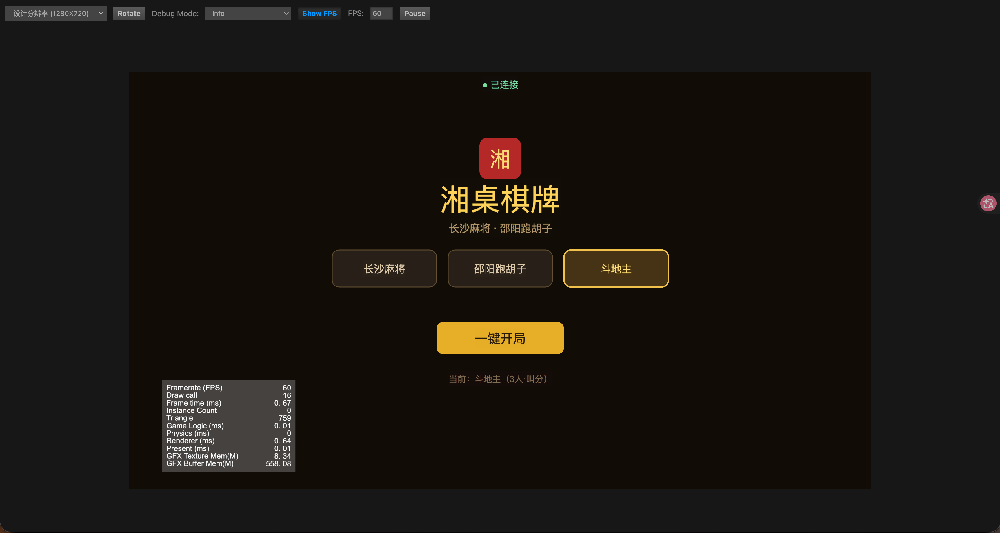
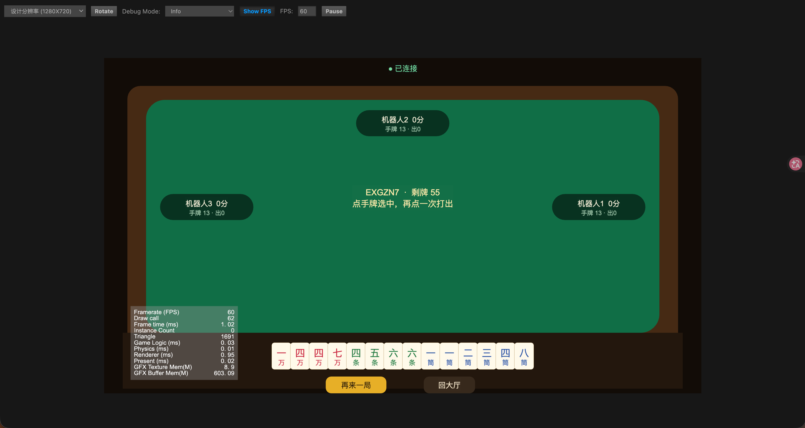
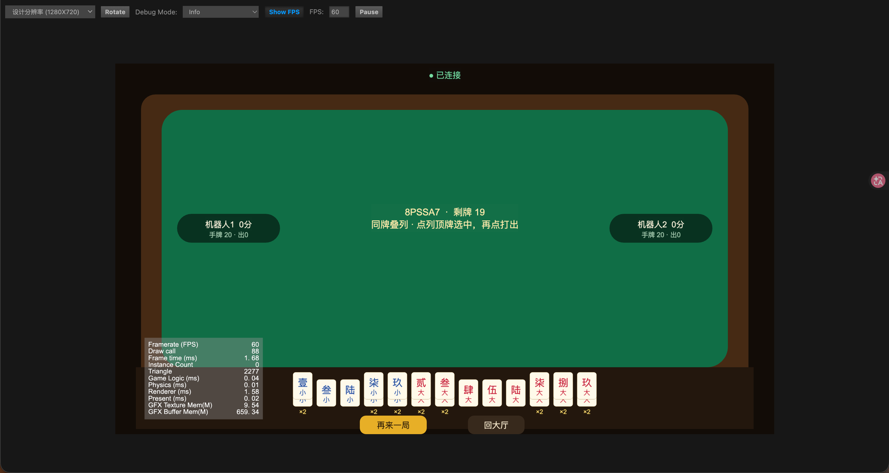
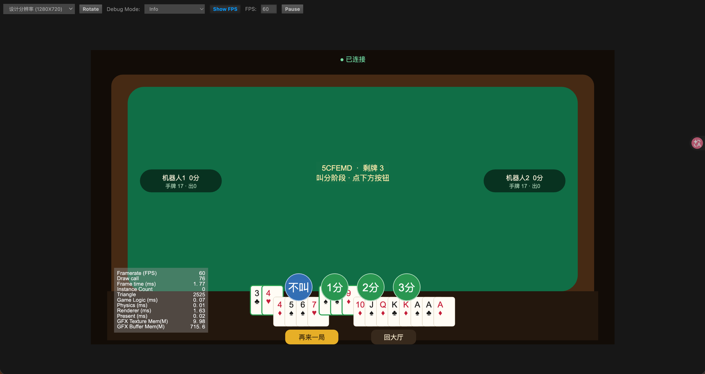

# 湘桌棋牌 · 长沙麻将 / 邵阳跑胡子 / 斗地主

> **技术栈（对齐商业招聘）**  
> 后端：**Skynet + Lua** · 前端：**Cocos Creator 3.8.8** · 通信：**WebSocket JSON**  
> 玩法：长沙麻将 · 邵阳跑胡子 · 斗地主 · **服务端权威**

仓库：[github.com/liuchao0739/hunan-boardgame-demo](https://github.com/liuchao0739/hunan-boardgame-demo)

---

## 效果预览

| 大厅 | 长沙麻将 |
|:---:|:---:|
|  |  |

| 邵阳跑胡子 | 斗地主 |
|:---:|:---:|
|  |  |

> Cocos Creator 3.8.8 预览截图 · 服务端 Skynet Lua 权威判定 · 含人机对战

---

## 架构

```
Cocos Creator 3.8.8 客户端（client/）
        │  WebSocket JSON
        ▼
Skynet ws_gate（多 agent）
        ▼
room_mgr ── room.lua
        ├── game/changsha_mj.lua
        ├── game/shaoyang_phz.lua
        └── game/doudizhu.lua
```

| 模块 | 路径 | 说明 |
|------|------|------|
| Skynet 框架 | `server/skynet/` | cloudwu/skynet submodule |
| 业务配置 | `server/config` | `ws_port=9948` |
| 网关 | `server/service/ws_gate.lua` | WebSocket 接入 |
| 房间 | `server/service/room_mgr.lua` + `lualib/room.lua` | 座位/机器人/广播 |
| 长沙麻将 | `server/lualib/game/changsha_mj.lua` | 吃碰杠胡、七对、抓鸟 |
| 邵阳跑胡子 | `server/lualib/game/shaoyang_phz.lua` | 吃碰跑提、胡息 |
| 斗地主 | `server/lualib/game/doudizhu.lua` | 叫分/出牌（简化牌型） |
| Cocos 客户端 | `client/` | Creator 3.8.8 正式前端 |

---

## 快速启动

### 1. 启动 Skynet 服

```bash
cd server
./run.sh
# → ========== 湘桌 Skynet WS :9948 ==========
```

### 2. Cocos 客户端

1. 安装 **Cocos Creator 3.8.8**
2. 打开工程目录 `client/`（见 `client/README.md` / `client/第一次打开.md`）
3. Canvas 挂 `GameApp`，`wsUrl` = `ws://127.0.0.1:9948`
4. 预览 ▶ → 选玩法 → 一键开局

---

## 协议摘要

客户端 → 服：`create_room` / `join_room` / `fill_bots` / `ready` / `action`  
服 → 客户端：`hello` / `room_created` / `joined` / `state` / `error`

---

## 说明

- 权威逻辑在 **Lua/Skynet**；`src/` 下旧 TS 引擎仅作对照单测（`npm test`）。
- 长沙麻将 2D 牌面取自开源 [口袋麻将](https://github.com/winktzhong/PocketMahjongClient)（MIT），对照清单见 [`docs/POCKET_MAHJONG_REF.md`](docs/POCKET_MAHJONG_REF.md)。
- 跑胡子 / 斗地主仍为程序化牌面；完整第三方声明见 `THIRD_PARTY_NOTICES.md`。
- 截图目录：`docs/screenshots/`

## License

MIT
